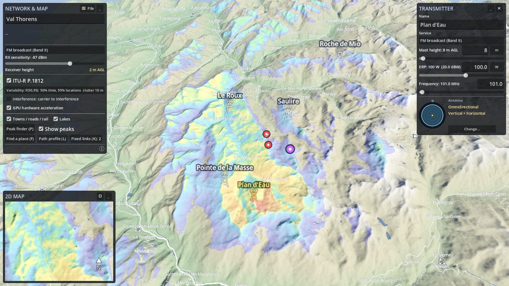
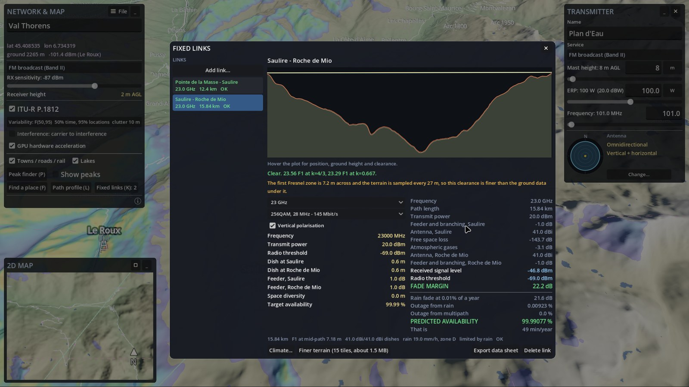
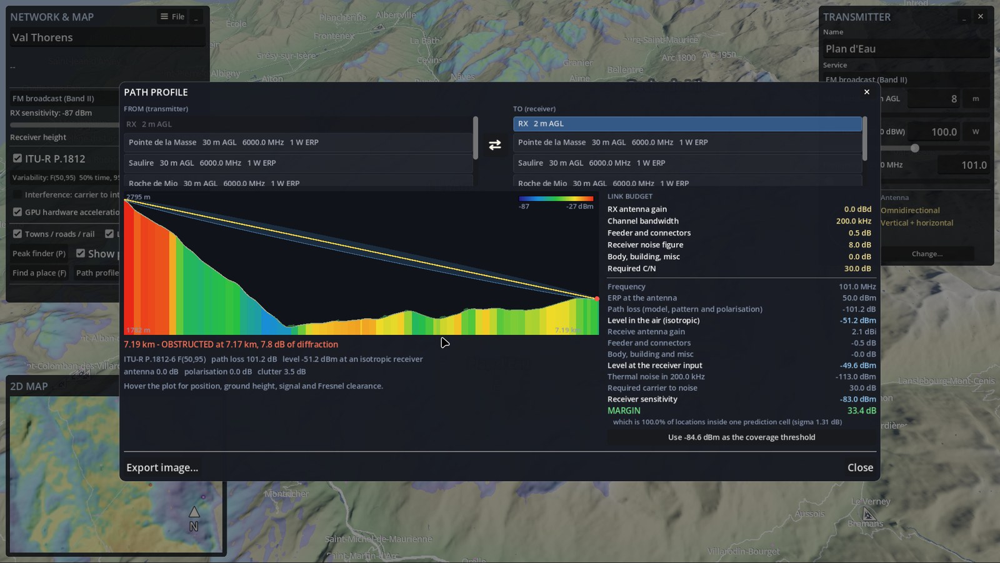
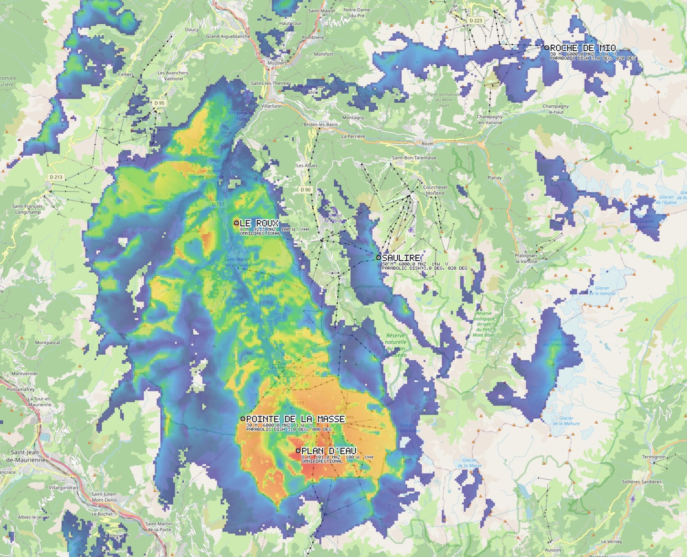
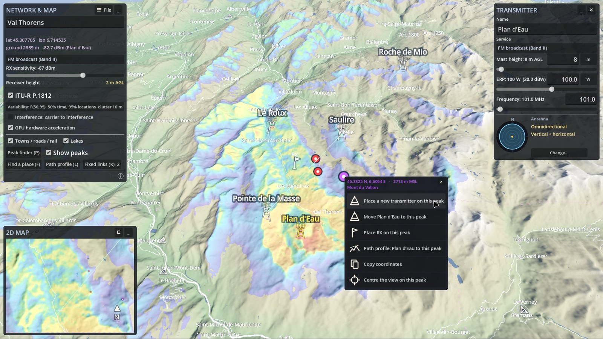

<!--
  GENERATED by release.py from simtx's release/README.template.md.
  Edit it there; a change made here is overwritten on the next release.
-->

  

<h1 align="center">HorizonRF</h1>

  <strong>Radio coverage planning over real terrain, anywhere on Earth.</strong> 
  Search for a place, drop your sites on the mountains, and see where the signal goes.

  
  
  
  

  <a href="https://github.com/michaeljtbrooks/horizonrf/releases/latest/download/HorizonRF-windows-x86_64.zip"><strong>⬇ Download for Windows</strong></a>
  &nbsp;&nbsp;·&nbsp;&nbsp;
  <a href="https://github.com/michaeljtbrooks/horizonrf/releases/latest/download/HorizonRF-linux-x86_64.tar.gz"><strong>⬇ Download for Linux</strong></a>
   
  Version 2026.09.2, released 2026-09-28 &nbsp;·&nbsp; <a href="https://github.com/michaeljtbrooks/horizonrf/releases">All versions</a> &nbsp;·&nbsp; <a href="https://github.com/michaeljtbrooks/horizonrf/releases/latest/download/SHA256SUMS.txt">SHA-256 checksums</a>

  

---

## What it does

HorizonRF is a desktop RF planning tool for anybody who needs to know where a transmitter will be heard before the mast goes up: broadcasters, land mobile and PMR dealers, wireless ISPs, drone operators, event radio crews and radio amateurs.

- **Real terrain, anywhere.** Type a place name or coordinates, choose how much ground you want, and HorizonRF builds a 3D model of it from open elevation data, with towns, roads, rail, lakes and land cover laid over it.
- **ITU-R P.1812-6 coverage prediction.** The same point-to-area method professional tools use, with terrain diffraction, the curvature of the Earth, the local atmosphere and ground clutter. Checked against the ITU's own reference implementation to within 0.000001 dB.
- **Fast.** Coverage sweeps run on the graphics card, so a prediction is back moments after you move a site or change its height. Without a suitable card the same model runs on the processor, with the same results.
- **Networks, not just sites.** Place as many transmitters as you need, and switch to a **carrier-to-interference (C/I)** map to see where they tread on each other.
- **Point-to-point analysis.** A **path profile** between any two points with the Fresnel zone and the controlling obstacle, and a full **link budget** underneath it.
- **Fixed microwave links.** Plan backhaul hops under **ITU-R P.530-18**, with rain fade, atmospheric gases and multipath, up to 54 GHz. Each link gives a fade margin and a predicted availability in minutes per year.
- **34 service presets.** FM, DAB and DTT broadcast; mobile bands from 700 MHz to 2.6 GHz; PMR446, DMR, TETRA and VHF land mobile; marine and airband VHF; utility telemetry and private LTE; LoRaWAN and Wi-Fi; drone control and video; and the amateur bands from 6 m to 6 cm.
- **Your antennas.** Import manufacturer radiation patterns in **MSI Planet** (`.msi`, `.pln`, `.ptn`) or **NSMA** (`.adf`) format, then set the bearing, downtilt and polarisation of each site.
- **Peak finder.** Drag across the map to find the high ground, then right-click a peak to put a site on it.
- **Exports that go somewhere.** Coverage as a georeferenced PNG with a world file for GIS, or as a **KMZ** for Google Earth; path profiles as images; link data sheets for the paperwork.
- **Works offline once the map is loaded.** Projects save everything they need, and map data is cached across projects.

## Screenshots

<table>
  <tr>
    <td width="50%"></td>
    <td width="50%"></td>
  </tr>
  <tr>
    <td align="center"><b>Fixed microwave links</b>: fade margin, rain outage and availability for each hop</td>
    <td align="center"><b>Path profile and link budget</b>: the ground coloured by predicted signal</td>
  </tr>
  <tr>
    <td width="50%"></td>
    <td width="50%"></td>
  </tr>
  <tr>
    <td align="center"><b>Exported coverage</b>: georeferenced, with every site labelled</td>
    <td align="center"><b>Peaks</b>: right-click the high ground to build on it</td>
  </tr>
</table>

## Getting started

| | Windows | Linux |
|---|---|---|
| **Download** | [HorizonRF-windows-x86_64.zip](https://github.com/michaeljtbrooks/horizonrf/releases/latest/download/HorizonRF-windows-x86_64.zip) | [HorizonRF-linux-x86_64.tar.gz](https://github.com/michaeljtbrooks/horizonrf/releases/latest/download/HorizonRF-linux-x86_64.tar.gz) |
| **Install** | Unzip it anywhere | `tar xzf HorizonRF-linux-x86_64.tar.gz` |
| **Run** | `HorizonRF.exe` | `./HorizonRF.x86_64` |

There is no installer. Each download is a single program, with its licence and a short `README-FIRST.txt` beside it.

**Windows says "Windows protected your PC".** The program is not yet code-signed, so SmartScreen warns the first time. Choose **More info**, then **Run anyway**.

**The first time you open a place, HorizonRF needs an internet connection** to fetch its terrain and map. After that, the ground is cached on your machine.

### System requirements

- 64-bit Windows 10 or 11, or 64-bit Linux
- A graphics card with Direct3D 12 or Vulkan support
- An internet connection for the first visit to any area

macOS is not available yet.

## The beta

**During the beta, every copy has every feature, free.** There is no account to create and no telemetry.

The beta will end with notice. After that a free tier remains, with one site at a time over a smaller area, and the network, interference, export and microwave link features become paid tiers. Projects you make during the beta will still open.

## Accuracy

HorizonRF is a planning aid. Its predictions come from public terrain and land cover data and a published propagation model, so they are only as good as both. They are not a substitute for a site survey or a measurement campaign, and are not suitable as evidence for licensing, regulatory compliance, safety cases or interference disputes.

HorizonRF is an independent implementation of the ITU-R Recommendations it uses and is not endorsed by, or affiliated with, the ITU.

## Data and credits

- Map data © [OpenStreetMap](https://www.openstreetmap.org/copyright) contributors, under the ODbL
- Land cover: [ESA WorldCover](https://esa-worldcover.org) 10 m, © ESA, under CC BY 4.0
- Elevation: [Terrain Tiles](https://registry.opendata.aws/terrain-tiles/) on the AWS Open Data registry
- Place search: [LocationIQ](https://locationiq.com) and [Nominatim](https://nominatim.org)
- Built with the [Godot Engine](https://godotengine.org), under the MIT licence

Exported maps carry the attribution their data requires. Please do not crop it off.

## Licence and contact

HorizonRF is proprietary software, © 2026 Dr Michael Brooks. It is free to use during the beta under the terms in the `LICENSE` file that comes with each download. The source code is not public.

Questions, bug reports and licence enquiries: **horizonrf -AT- onleygroup.com**, or [open an issue](https://github.com/michaeljtbrooks/horizonrf/issues).
